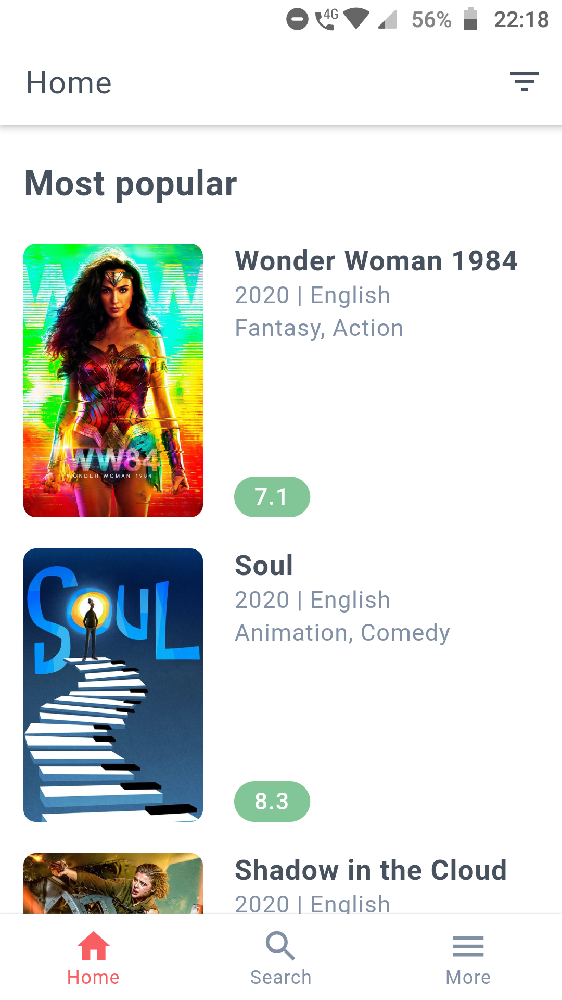
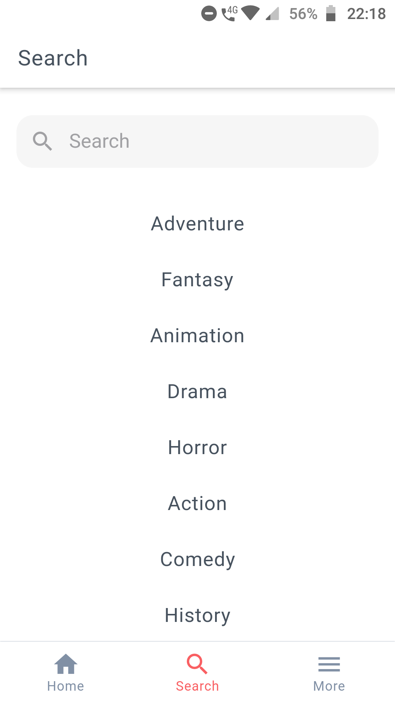
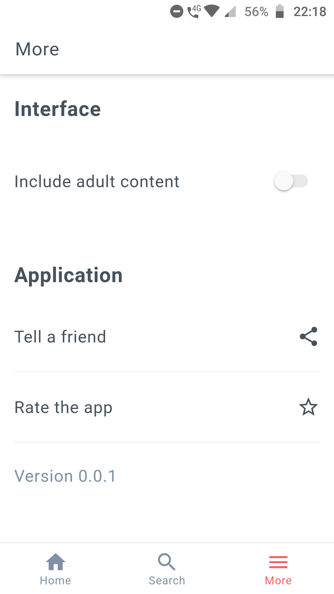

  
  <h3 align="center">Cinephile Flutter</h3>

---

## Overview

Cinephile Flutter is an application developed with Flutter it will make it easy the way you search for information about films and actors.

## Preview

<table>
  	<tr>
	  	<td style="border: 2px solid #d6d6d6; padding: 0;"></td>
		<td style="border: 2px solid #d6d6d6; padding: 0;"></td>
		<td style="border: 2px solid #d6d6d6; padding: 0;"></td>
		<td style="border: 2px solid #d6d6d6; padding: 0;"></td>
	</tr>
	<tr>		
		<td style="border: 2px solid #d6d6d6; padding: 0;"></td>
		<td style="border: 2px solid #d6d6d6; padding: 0;"></td>
		<td style="border: 2px solid #d6d6d6; padding: 0;"></td>
	</tr>
</table>

## APIs

- [TMDb](https://developers.themoviedb.org/3/getting-started/introduction)

## Running the project

- You need to set up all the Flutter enviroment
- Clone this repository
- Install all dependencies using the command `flutter pub get.`
- Fill the `.env` file
- If you are in VScode press `F5` to execute the App

## Used technologies

- Flutter
- Dio
- Mobx
- Photo View
- Webview Flutter
- Other Flutter libs